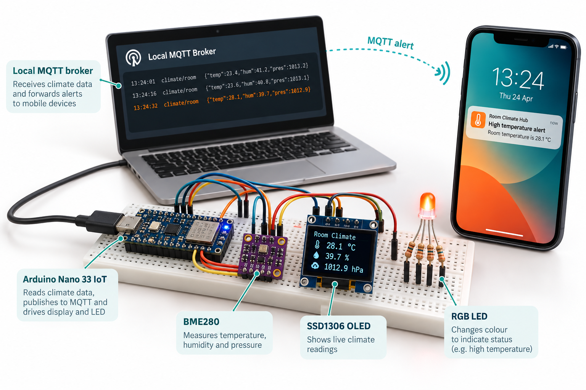
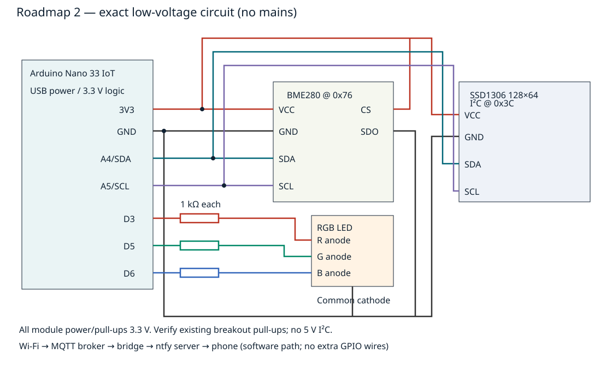

# Room Climate Hub Mobile Alerts

Roadmap **2**: an Arduino Nano 33 IoT reads a BME280, shows climate measurements on an SSD1306 OLED, indicates status with a common-cathode RGB LED, and publishes MQTT telemetry. A configurable Python bridge turns confirmed high-temperature events into ntfy mobile notifications. This is an educational low-voltage prototype, not a safety alarm.



The original generated illustration is conceptual; displayed numbers are illustrative, not test measurements or wiring instructions. The exact thresholds and connections below govern the implementation.

## Objectives and features

- Measure temperature, relative humidity and pressure every two seconds.
- Require three consecutive readings at or above 30 °C before alerting; clear at or below 28 °C.
- Show live measurements and network status locally even without MQTT.
- Reject invalid sensor readings, output JSON nulls rather than NaN, and indicate faults in magenta.
- Bridge MQTT to a configured ntfy server with a five-minute repeated-alert cooldown and retry after failed notification delivery.

## Architecture and platform

Nano 33 IoT (SAMD21 + NINA Wi-Fi) → Wi-Fi → MQTT broker → `tools/mobile_bridge.py` → configured ntfy server → subscribed phone. BME280 and OLED share I²C. The bridge may run on a cloud host; the user's desktop is not part of this repository's automation. Device-to-broker networking must exist, e.g. a lab LAN or managed private route. Firmware uses plain MQTT port 1883 for an isolated lab LAN; do not expose that port to the Internet. The bridge can use TLS MQTT with `MQTT_TLS=1`. Production deployments need TLS/authentication on the device path too.

## Bill of materials

| Part | Quantity | Required variant |
| --- | ---: | --- |
| Arduino Nano 33 IoT | 1 | 3.3 V logic; USB powered |
| BME280 breakout | 1 | I²C, 3.3 V powered; SDO tied low selects 0x76; CS high |
| SSD1306 OLED | 1 | 128×64, four-pin I²C, 3.3 V compatible, address 0x3C |
| RGB LED | 1 | Discrete common cathode |
| 1 kΩ resistor | 3 | One series resistor per LED anode; conservative GPIO current |
| Breadboard and jumpers | 1 set | No mains connections |
| USB data cable | 1 | Appropriate connector for board |
| MQTT broker and ntfy server | 1 each | Software services, can share an authorized host |
| Phone with ntfy client | 1 | Subscription to configured server/topic |

## Prerequisites

PlatformIO Core 6.1.18, Python 3.12, a C++17 compiler for host tests, and Python dependencies in [requirements.txt](requirements.txt). Nano NINA firmware must support WiFiNINA; update using Arduino's firmware updater if connection fails. Board and library versions are pinned in [platformio.ini](platformio.ini). External dependency licenses remain their own; our original code is MIT.

## Exact pin map and circuit



| Nano pin | Connection |
| --- | --- |
| 3V3 | BME280 VCC, BME280 CS, OLED VCC |
| GND | BME280 GND and SDO, OLED GND, RGB common cathode |
| A4 / SDA | BME280 SDA and OLED SDA |
| A5 / SCL | BME280 SCL and OLED SCL |
| D3 | 1 kΩ resistor → RGB red anode |
| D5 | 1 kΩ resistor → RGB green anode |
| D6 | 1 kΩ resistor → RGB blue anode |
| USB | Board power and serial; do not wire USB 5 V to sensors |

Use breakouts with I²C pull-ups to **3.3 V**, never 5 V. Many boards contain pull-ups; check effective resistance and avoid blindly adding multiple parallel pull-ups. Check the exact LED lead order from its datasheet; do not infer it from lead position. Firmware drives LED channels digitally, not PWM. Green = normal, red = high temperature, magenta = sensor fault, initial blue = startup. No actuator is attached.

## Assembly

1. Disconnect USB. Identify the actual module voltage ratings, I²C address straps and LED cathode.
2. Wire common ground and 3.3 V; connect A4/A5 to both modules.
3. Strap BME CS to 3.3 V and SDO to ground when those pins are exposed; use a breakout preconfigured to 0x76 otherwise. Do not connect SPI-only modules.
4. Connect three LED anodes through individual 1 kΩ resistors to D3/D5/D6; cathode to ground.
5. Inspect for shorts, then apply USB power. Do not power exposed electronics from mains.

## Setup and flashing

```sh
python -m venv .venv
. .venv/bin/activate
pip install platformio==6.1.18
cp firmware/room-climate-hub-mobile-alerts/config.local.example.h firmware/room-climate-hub-mobile-alerts/config.local.h
# Edit the ignored local header with your own lab Wi-Fi and broker settings.
pio run -e nano_33_iot
pio run -e nano_33_iot -t upload
pio device monitor -b 115200
```

These are build instructions for a person assembling the prototype; the publishing workflow runs on cloud CI. Never commit `config.local.h` or real credentials. Without that file the committed default configuration uses empty network settings, so sensor/display/serial work while networking is disabled.

## Configuration and mobile usage

The firmware's `config.h` sets sample interval 2000 ms, network retry interval 15000 ms, BME address 0x76, OLED 0x3C and MQTT port 1883. Temperature thresholds live in `alert_policy.h` and are exercised by host tests. Each deployment needs a unique MQTT client ID and topic prefix; this project defaults to `omp-climate-002` and `openmaker/2`.

Configure a broker accessible to the device and bridge. On the bridge host:

```sh
pip install -r requirements.txt
export MQTT_HOST=192.0.2.10  # Documentation example; replace with actual broker.
export MQTT_PORT=1883
export NTFY_URL=https://notify.example.test  # Replace with your authorized server.
export NTFY_TOPIC=replace_with_private_topic
# Optional MQTT_USER, MQTT_PASSWORD, MQTT_TLS=1, NTFY_TOKEN from runtime environment.
python tools/mobile_bridge.py
```

No remote notification service is contacted by CI or tests. Configure server authentication and subscribe the phone's ntfy client to this exact server/topic, grant notification permission, and test app delivery before relying on it. For lab simulation, publish the synthetic [example JSON](sample-data/example.json) to `openmaker/2/telemetry` using your broker's CLI. A configured bridge sends a temperature message after the first alert and every five minutes while active. Normal telemetry clears its cooldown state; a later alert notifies immediately. On delivery failure it retries on a later sample. QoS 0 messages may be lost; there is no offline queue or guaranteed delivery.

## Telemetry and expected output

`openmaker/2/telemetry`: non-retained JSON, project_id integer 2; seq unsigned sample counter; uptime_ms wraps at 32-bit millis; valid boolean; temperature_c in °C; humidity_pct in percent; pressure_hpa in hPa; alert boolean. Invalid measurements become null and alert false. Sample JSON is synthetic and labeled as such here. `openmaker/2/availability` is retained online/offline with MQTT last will; a broker may only notice an abrupt disconnect after keepalive timeout. Serial prints identical telemetry at 115200 baud. OLED shows temperature, humidity, pressure, threshold state and MQTT online/offline.

## Validation and actual run results

Cloud host policy tests, mobile bridge tests (mocked sender, no delivery), PNG transport tests, metadata/link/SVG/secret validation and a representative Nano 33 IoT board compilation are required by CI before merge. See [validation results](docs/validation-results.md) for actual outcomes and CI evidence. No physical sensor calibration, electrical test, Wi-Fi association or phone delivery test has been performed by the publishing agent. A software compile is not hardware testing.

```sh
g++ -std=c++17 -Wall -Wextra -Werror tests/alert_policy_test.cpp -o /tmp/alert-policy
/tmp/alert-policy
python -m unittest discover -s tests -v
python tools/validate.py
python tools/validate_completion.py
pio run -e nano_33_iot
```

## Troubleshooting

Sensor fault: confirm BME280 rather than BMP280, CS/SDO straps, 0x76 address, 3.3 V and ground. Blank OLED: check 128×64 SSD1306, address 0x3C, power and pull-ups. MQTT offline: configure ignored header, verify 2.4 GHz Wi-Fi/NINA firmware, broker route and port. No mobile notification: check telemetry alert true, broker subscription, ntfy URL/topic/authentication and phone permissions; red LED alone does not prove delivery. Too many alerts: inspect threshold/hysteresis and bridge restart frequency; cooldown is in-memory and resets on restart. Build failures: use pinned dependencies and board, inspect the CI logs rather than switching hardware silently.

## Limitations and domain safety

Humidity/pressure are displayed but do not independently trigger notifications. Temperature confirmation spans roughly six seconds; WiFiNINA connection calls and network activity can extend cadence. Local OLED/LED operation continues during MQTT outage but there is no missed-alert persistence, broker authentication in the demo firmware, device TLS, watchdog recovery or durable bridge cooldown. Never use this device for fire, medical, gas or other critical alarms. Keep moisture away from electronics; handle sensors gently; do not heat the board to test thresholds. Use injected synthetic messages for software tests, and independently validate physical accuracy and network security before deployment.

## Future work

Device MQTT TLS/authentication, persistent bounded retry queue, sensor calibration, monotonic sample scheduling across blocking connections, durable notification cooldown, broker disconnect metrics and configurable humidity alarms.

## Contributing and license

Submit changes by PR with pin-map/code/SVG consistency, host tests, board build and honest hardware-test evidence. Report issues with sanitized logs only. Original project work is under the [MIT License](LICENSE); dependency licenses are not replaced.

## Primary references

- [Arduino Nano 33 IoT datasheet](https://docs-content.arduino.cc/resources/datasheets/ABX00027-datasheet.pdf)
- [PlatformIO Nano 33 IoT board](https://docs.platformio.org/en/latest/boards/atmelsam/nano_33_iot.html)
- [Adafruit BME280 driver](https://github.com/adafruit/Adafruit_BME280_Library)
- [ntfy publishing API](https://docs.ntfy.sh/publish/)
